# RML_Final_Project

## Model Card

### Basic Information

* **Person or organization developing model**: Joon kyu Hong, `joonhong96@gwu.edu`
* **Model date**: July 1st, 2023
* **Model version**: 1.0
* **License**: MIT
* **Model implementation codes**:

[RML_Assignment1_Joonkyu_Hong.ipynb](https://github.com/JOONKYUHONG/DNSC6290_RML/blob/main/RML_Assignment%201_%20Joonkyu%20Hong.ipynb)

[RML_Assignment2_Joonkyu_Hong.ipynb](https://github.com/JOONKYUHONG/DNSC6290_RML/blob/main/RML_Assignment%202_Joonkyu%20Hong-Copy1.ipynb)

[RML_Assignment3_Joonkyu_Hong.ipynb](https://github.com/JOONKYUHONG/DNSC6290_RML/blob/main/RML_Assignment%203_Joonkyu%20Hong.ipynb)

[RML_Assignment4_Joonkyu_Hong.ipynb](https://github.com/JOONKYUHONG/DNSC6290_RML/blob/main/RML_Assignment%204_Joonkyu%20Hong.ipynb)

[RML_Assignment5_Joonkyu_Hong.ipynb](https://github.com/JOONKYUHONG/DNSC6290_RML/blob/main/RML_Assignment%205_Joonkyu%20Hong.ipynb) 


### Intended Use

* **Business Value**: Enhancing educational value for students studying mortgage lending in an academic setting.
* **Objective**: Providing practical experience in responsible machine learning projects for educational purposes.
* **Intended Users** : MSBA students and educators in the academic context of responsible machine learning.
* **Additional Information** : Valuable educational resource for GWU students.
  
### Training Data

* Data dictionary: Originally, the dataset contained over 20 columns, but for the project's purpose, the focus was narrowed down to the main factors that significantly influence the primary target variable.

| Name                      | Modeling Role | Measurement Level | Description                                                                                     |
|---------------------------|---------------|-------------------|-------------------------------------------------------------------------------------------------|
| high priced               | target        | binary            | Binary target indicating whether the APR charged for a mortgage is 1.5% or more above the survey-based estimate of similar mortgages    |
| conforming                | input         | binary            | Binary numeric input indicating whether the mortgage conforms to normal standards (1) or is different (0)                              |
| debt to income ratio std  | input         | numeric           | Standardized debt-to-income ratio for mortgage applicants                                        |
| debt to income ratio missing  | input         | binary        | Binary numeric input serving as a missing marker (1) for debt-to-income ratio std                 |
| income std                | input         | numeric           | Standardized income for mortgage applicants                                                     |
| loan amount std           | input         | numeric           | Standardized amount of the mortgage for applicants                                              |
| intro rate period std     | input         | numeric           | Standardized introductory rate period for mortgage applicants                                   |
| loan to value ratio std   | input         | numeric           | Ratio of the mortgage size to the value of the property for mortgage applicants                 |
| no intro rate period std  | input         | binary            | Binary numeric input indicating whether a mortgage does not include an introductory rate period |
| property value std        | input         | numeric           | Value of the mortgaged property                                                                 |
| term 360                  | input         | binary            | Binary numeric input indicating whether the mortgage is a standard 360-month mortgage (1) or a different type (0)                  |


* **Source of training data**: GWU Blackboard, email `jphall@gwu.edu` for more information
* **How training data was divided into training and validation data**: 70% training, 30% validation
* **Number of rows in training and validation data**:
  * Training rows: 112253 rows
  * Validation rows: 48085 rows


* **Source of test data**: GWU Blackboard, email `jphall@gwu.edu` for more information
* **Number of rows in test data**: 19831 rows.
* **State any differences in columns between training and test data**: Training data contains 23 rows, while Test data contains 22 rows since we need to predict the target variable and probabiltiy when we test the best remediated model. 

### Evaluation (test) Data

* **Source of test data**: GWU Blackboard, email `jphall@gwu.edu` for more information
* **Number of rows in test data**: 19831 rows.
* **Differences in columns between training and test data**: The training data contains 23 columns, while the test data contains 22 columns since we need to predict the target variable and probability when testing the best remediated model.
### Model details
* **Columns used as inputs in the final model**:
```

rem_x_names = ['term_360',
 'no_intro_rate_period_std',
 'property_value_std',
 'intro_rate_period_std',
 'income_std',
 'debt_to_income_ratio_std',
 'conforming']

```
* **Column(s) used as target(s) in the final model**: 'high_priced'
* **Type of model**: XGBoost
* **Software used to implement the model**: Python, xgboost
* **Version of the modeling software**: 3.10.9, 1.7.5
* **Hyperparameters or other settings of your model**: 
```
rem_params = {'max_depth': 9,
 'learning_rate': 0.05,
 'subsample': 1.0,
 'colsample_bytree': 0.6,
 'min_child_weight': 5,
 'gamma': 0.1,
 'reg_alpha': 0.1,
 'reg_lambda': 1.0,
 'n_jobs': -1,
 'random_state': 12345}
```
### Quantitative Analysis

* **Metrics used to evaluate the best remediated model**:
  
| Group | Validation AIR |
|-------|-----|
| Asian vs. White | 1.148|
| Black vs. White | 0.806 |
| Hispanic vs. White | 0.875|
| Female vs. Male | 0.945 |

* Values of the metrics for training, validation, and evaluation (or test) data
 
| Train AUC | Validation AUC | Test AUC |
| ------ | ------- | -------- |
| 0.3456 | 0.7891  | 0.7687|


(*Test AUC taken from https://github.com/jphall663/GWU_rml/blob/master/assignments/model_eval_2023_06_21_12_52_47.csv)

#### Correlation Heatmap
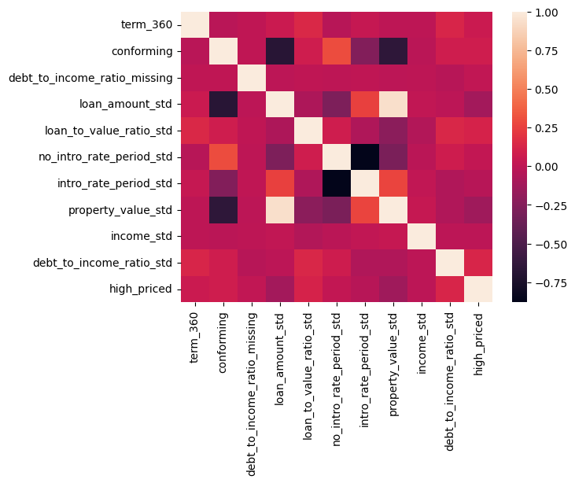

*Basic correlation from our data.

#### Post-hoc Explanation 
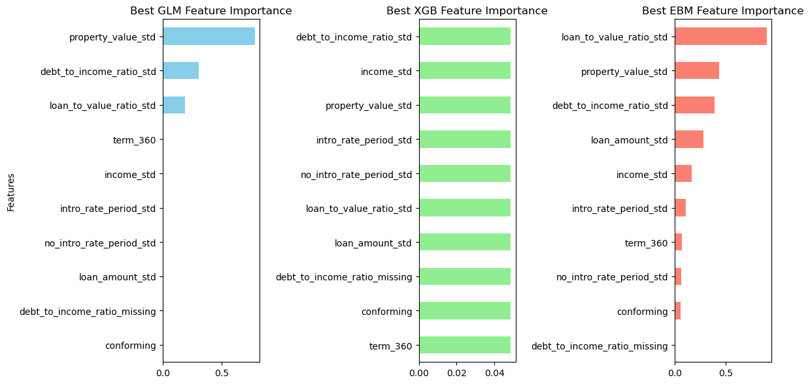

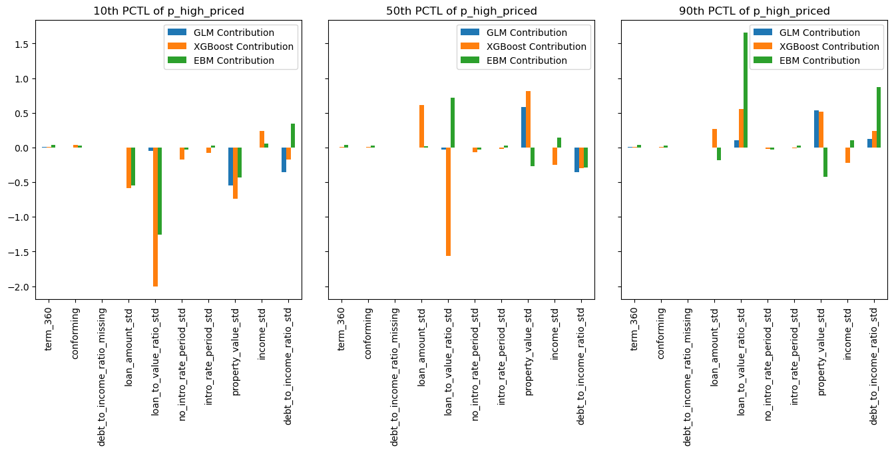
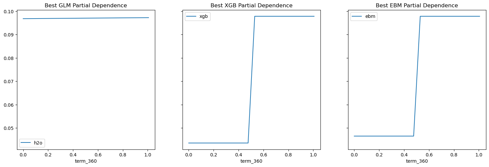
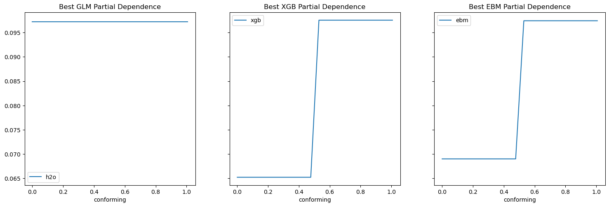
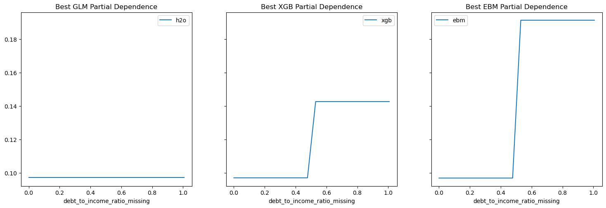
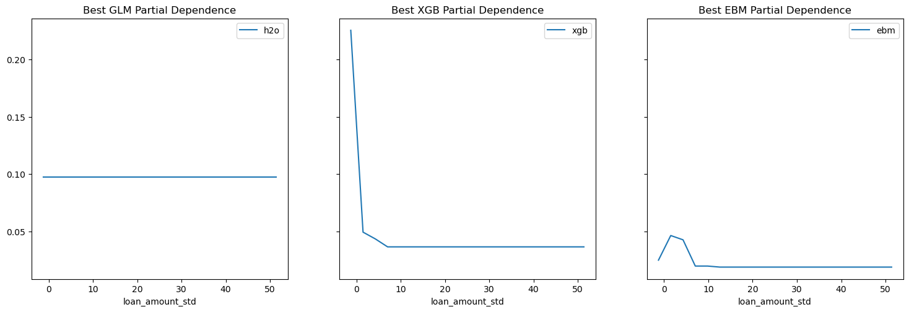
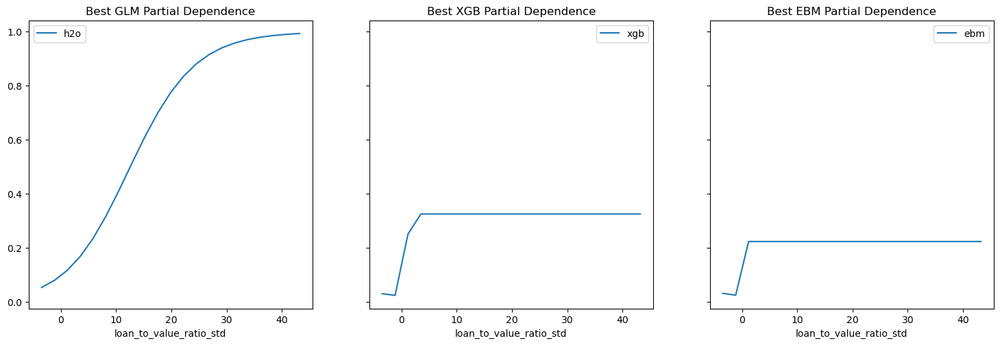
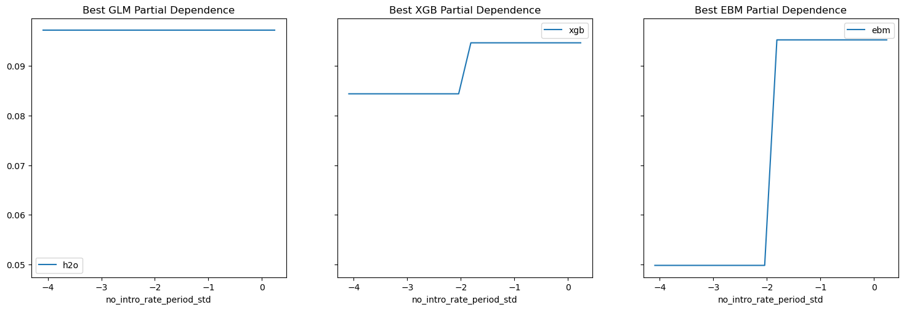
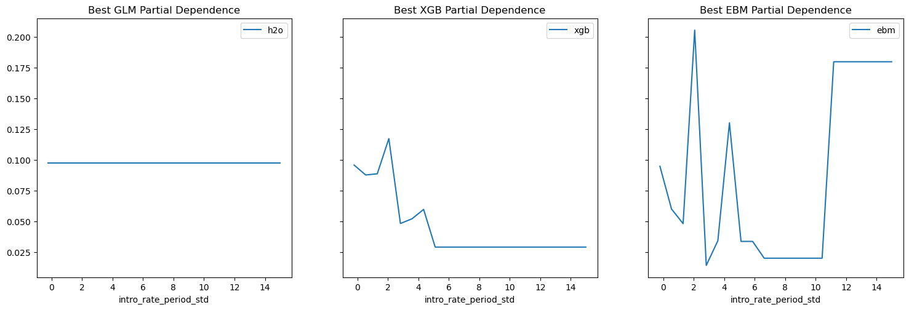

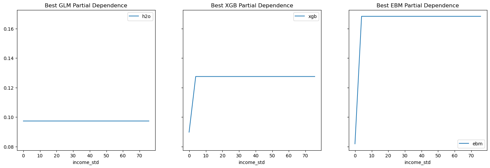
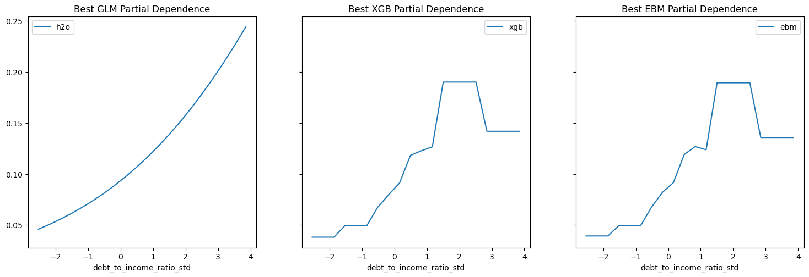

#### Visualization of AIR vs. AUC for Bias testing
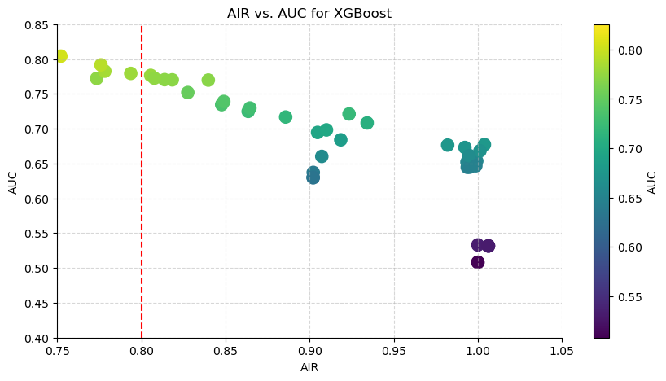

*Since we need to retrain most accurate model above 0.8 AIR, it is important to check the plots for AIR vs AUC.

#### Becision tree model for red teaming
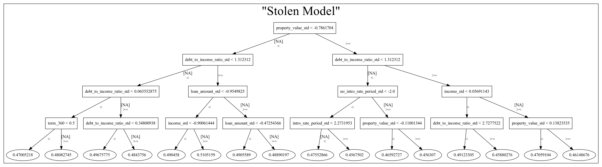

* A basic flow chart for how the XGB model works.

#### Model Debugging - Residual analysis
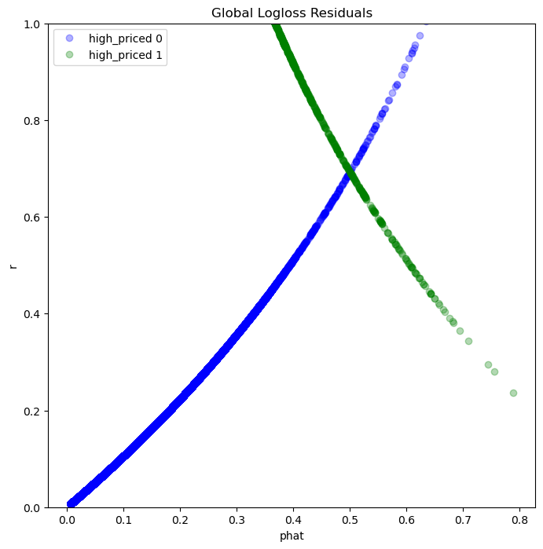

* **Alternative models considered** : Among the three models trained, namely Lasso, EBM, and XGBoost, the XGBoost model demonstrates superior performance in terms of test AUC when compared to the AUC obtained from the other two models.

### Ethical considerations

* **Describe potential negative impacts of using your group’s best remediated model** : 
  * Consider math or software problems: As mathematical and statistical software and libraries continuously evolve and update, it is crucial to ensure compatibility with the specific version used during the model's development. If individuals employ a different version and obtain incorrect values, it can lead to unexpected risks or erroneous outcomes.

  * Consider real-world risks: who, what, when and how?: While our model is primarily designed for educational purposes, caution must be exercised when applying it to real-life scenarios, such as predicting mortgage lending outcomes. The model may not account for all the intricacies and variables involved in the real world, potentially leading to less accurate predictions and suboptimal decision-making. If one of college student has limited knowledge and experience in the nuances and limitations of machine learning models, he or she may not fully comprehend the assumptions made during model development or the potential risks associated with relying solely on model predictions for financial decision-making.

* **Describe potential uncertainties relating to the impacts of using your group’s best remediated model**:
  * Consider math or software problems: The mathematical model can encompass intricate algorithms and calculations. The complexity of the model can introduce uncertainty when it comes to understanding and interpreting the results. It can be challenging for the model to accurately capture the underlying mathematical concepts and determine whether the implemented calculations are free from errors. 

   * Consider real-world risks: who, what, when and how? : Consider a scenario in which the government introduces new regulations or policies that directly impact the mortgage lending industry.  In such a situation, utilizing our group's best remediated model to predict mortgage lending outcomes can introduce uncertainties. The model may not have been trained on data that incorporates the newly implemented policy changes, leading to potential inaccuracies in its predictions or suboptimal decision-making. By continuously monitoring and adapting the model to reflect the evolving regulatory landscape, we can mitigate uncertainties and improve its performance in real-world applications.
    
* **Describe any unexpected or results encountered during training**: During the evaluation of my remediated XGBoost model, I encountered an error when running it with the test data. The error arose due to a feature shape mismatch, specifically between the valid[rem_x_names] DataFrame, which had 9 columns, and the test[x_names] DataFrame, which had 10 columns. This mismatch caused the error to occur. Curiously, I also observed a similar situation with the EBM model from the example code, where the valid[rem_x_names] DataFrame had 8 columns and the test[x_names] DataFrame had 10 columns. However, unlike the XGBoost model, the EBM model did not encounter a feature shape mismatch error when tested with the test data. Upon seeking assistance from Prof. Hall, I came to realize that XGBoost is quite particular in its requirements. It expects only the feature names it encountered during training to be present when making predictions. As a result, to obtain accurate test results with the XGBoost model, I needed to ensure that I provided exactly the remediated features that were used during training. By following Prof. Hall's advice and supplying the XGBoost model with the exact remediated features, I was able to successfully obtain the desired test results. This experience highlighted the importance of adhering to XGBoost's specific feature name requirements to avoid shape mismatch errors and ensure the model functions correctly during testing.


– Intended use (2 pts.)

∗ Describe the business value of your group’s best remediated model
∗ Describe how your group’s best remediated model is designed to be used
∗ Describe the intended users for your group’s best remediated model
∗ State whether your group’s best remediated model can or cannot be used for any additional
purposes
– Training data (2 pts.)
∗ State the source of training data
∗ State how training data was divided into training and validation data
∗ State the number of rows in training and validation data
∗ Define the meaning of all training data columns
∗ Define the meaning of all engineered columns
– Evaluation data (2 pts.)
∗ State the source of evaluation (or test) data
∗ State the number of rows in evaluation (or test) data
∗ State any differences in columns between training and evaluation (or test) data
– Model details (2 pts.)
∗ State the columns used as inputs in your group’s best remediated model
∗ State the columns used as targets in your group’s best remediated model
∗ State the type of your group’s best remediated model
∗ State the software used to implement your group’s best remediated model
∗ State the version of the modeling software for your group’s best remediated model
∗ State the hyperparameters or other settings of your group’s best remediated model
– Quantitative analysis (3 pts.)
∗ State the metrics used to evaluate your group’s best remediated model
∗ State the values of the metrics for training, validation, and evaluation (or test) data – evaluation (or test) metrics come from the most recent class full evaluation results, link under
Assignment 1.
∗ Provide at least one plot or table from each weekly assignment for a total of at least six plots,
that must include the global variable importance and partial dependence of your group’s best
remediated model.
∗ Address other alternative models considered
– Ethical considerations (2 pts.)
2
∗ Describe potential negative impacts of using your group’s best remediated model:
· Consider math or software problems
· Consider real-world risks: who, what, when and how?
∗ Describe potential uncertainties relating to the impacts of using your group’s best remediated
model:
· Consider math or software problems
· Consider real-world risks: who, what, when and how?
∗ Describe any unexpected or results encountered during training
